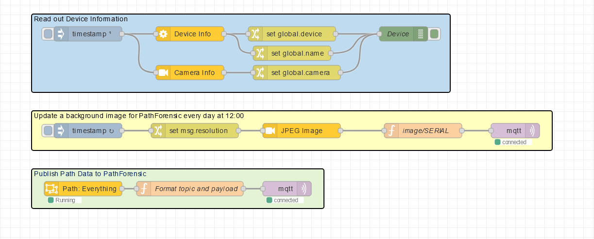

# Path Forensic
A Node-RED Application that collects data from Axis Cameras or Radars, stores them in a MongoDB and visaulize the results in a web dashboard (Node-RED).

## System Components
* PathForesnic repo hosts Node-RED/flows and a MongoDB in a Docker container
* Axis Cameras or Radars setup with Node-RED and flows that sends Path data to MQTT
  <br>You can filter unwanted detections/paths in the device (e.g. Area-Of-Intrest, minimum ditance, minimum age) to optimize the system
* MQTT Broker (this can easily be setup with a docker-compose)

## Installation
Clone repository (e.g. from /home/user/ )
```
git clone git@github.com:pandosme/PathForensic.git
cd PathForensic
```
Install npm packages. 
Requires Node and npm is installed on your computer
```
npm install
```

## Configuration
Before starting the application you havt to create and edit a ```docker-compose.yaml```
```
cp template/docker-compse.yaml .
nano docker-compose-yaml
```
Edit the following based on your system and environment:
```
    environment:
      - TZ=Europe/Stockholm
      - MQTT_BROKER_ADDRESS="1.2.3.4"
      - MQTT_BROKER_PORT=1883
      - MQTT_BROKER_USERNAME=
      - MQTT_BROKER_PASSWORD=
```
When done press Ctrl-s and Ctrl-x

## Setup Cameras & Radars
Follow these guides.
  - [Custom Object Analytics](https://pandosme.github.io/node-red/2024/04/13/Customized-Object-Analytics.html)
  - [Custom Radar Data Analytics](https://pandosme.github.io/node-red/2024/05/05/Custom-Radar-Data-Analytics.html)

The Simplest flow without any filtering looks like this


Flow (Copy/Paste to Device Node-RED):
```
[{"id":"868a37ab674ab944","type":"group","z":"e0e7702aa4ec0ec4","name":"Read out Device Information","style":{"stroke":"#000000","fill":"#bfdbef","label":true,"color":"#000000"},"nodes":["5df8aa2ba5986b98","101323b8789d7b70","ae2c9d572e22fe04","06e65218067bb025","5775a6e50398ac91","c4ab1f8904035103","c257f7a7e44df0ac"],"x":164,"y":79,"w":862,"h":162},{"id":"5df8aa2ba5986b98","type":"Axis device","z":"e0e7702aa4ec0ec4","g":"868a37ab674ab944","name":"","preset":"a5d60ef5587cc8fc","action":"Device Info","cgi":"","data":"","options":"","filename":"","x":490,"y":120,"wires":[["101323b8789d7b70","c257f7a7e44df0ac"]]},{"id":"101323b8789d7b70","type":"change","z":"e0e7702aa4ec0ec4","g":"868a37ab674ab944","name":"","rules":[{"t":"set","p":"device","pt":"global","to":"payload","tot":"msg"}],"action":"","property":"","from":"","to":"","reg":false,"x":700,"y":120,"wires":[["06e65218067bb025"]]},{"id":"ae2c9d572e22fe04","type":"inject","z":"e0e7702aa4ec0ec4","g":"868a37ab674ab944","name":"","props":[{"p":"payload"},{"p":"topic","vt":"str"}],"repeat":"","crontab":"","once":true,"onceDelay":0.1,"topic":"","payload":"","payloadType":"date","x":280,"y":120,"wires":[["5df8aa2ba5986b98","5775a6e50398ac91"]]},{"id":"06e65218067bb025","type":"debug","z":"e0e7702aa4ec0ec4","g":"868a37ab674ab944","name":"Device","active":true,"tosidebar":true,"console":false,"tostatus":false,"complete":"payload","targetType":"msg","statusVal":"","statusType":"auto","x":930,"y":120,"wires":[]},{"id":"5775a6e50398ac91","type":"Axis camera","z":"e0e7702aa4ec0ec4","g":"868a37ab674ab944","name":"","preset":"a5d60ef5587cc8fc","action":"Camera Info","resolution":"640x360","output":"Base64","filename":"","options":"","data":"","x":490,"y":200,"wires":[["c4ab1f8904035103"]]},{"id":"c4ab1f8904035103","type":"change","z":"e0e7702aa4ec0ec4","g":"868a37ab674ab944","name":"","rules":[{"t":"set","p":"camera","pt":"global","to":"payload","tot":"msg"}],"action":"","property":"","from":"","to":"","reg":false,"x":710,"y":200,"wires":[["06e65218067bb025"]]},{"id":"c257f7a7e44df0ac","type":"change","z":"e0e7702aa4ec0ec4","g":"868a37ab674ab944","name":"","rules":[{"t":"set","p":"name","pt":"global","to":"payload.hostname","tot":"msg"}],"action":"","property":"","from":"","to":"","reg":false,"x":700,"y":160,"wires":[["06e65218067bb025"]]},{"id":"a5d60ef5587cc8fc","type":"Device Access","name":"Localhost","address":"localhost","protocol":"http"},{"id":"20fa57c2e51e01d5","type":"group","z":"e0e7702aa4ec0ec4","name":"Update a background image for PathForensic every day at 12:00","style":{"stroke":"#000000","fill":"#ffffbf","label":true,"color":"#000000"},"nodes":["360bb8f62bbb29e7","fedbf82e4cc378d5","3e498c5ffda1e4d2","d7ef93abcb1c4df3","456e2d0308b7d068"],"x":164,"y":279,"w":1072,"h":82},{"id":"360bb8f62bbb29e7","type":"Axis camera","z":"e0e7702aa4ec0ec4","g":"20fa57c2e51e01d5","name":"","preset":"a5d60ef5587cc8fc","action":"JPEG Image","resolution":"640x360","output":"Base64","filename":"","options":"","data":"","x":720,"y":320,"wires":[["fedbf82e4cc378d5"]]},{"id":"fedbf82e4cc378d5","type":"function","z":"e0e7702aa4ec0ec4","g":"20fa57c2e51e01d5","name":"image/SERIAL","func":"var device = global.get(\"device\");\nif(!device)\n    return;\nvar camera = global.get(\"camera\");\nif(!camera)\n    return;    \n\nmsg.topic = \"image/\" + device.serial;\nmsg.payload = {\n    name: global.get(\"name\") || device.hostname || device.serial,\n    serial: device.serial,\n    device: device.serial,\n    rotation: camera.rotation,\n    aspect: camera.aspect,\n    timestamp: new Date().getTime(),\n    image: msg.payload,\n}\n\nreturn msg;\n","outputs":1,"timeout":0,"noerr":0,"initialize":"","finalize":"","libs":[],"x":970,"y":320,"wires":[["456e2d0308b7d068"]]},{"id":"3e498c5ffda1e4d2","type":"inject","z":"e0e7702aa4ec0ec4","g":"20fa57c2e51e01d5","name":"","props":[{"p":"payload"},{"p":"topic","vt":"str"}],"repeat":"","crontab":"00 12 * * *","once":true,"onceDelay":"5","topic":"","payload":"","payloadType":"date","x":280,"y":320,"wires":[["d7ef93abcb1c4df3"]]},{"id":"d7ef93abcb1c4df3","type":"change","z":"e0e7702aa4ec0ec4","g":"20fa57c2e51e01d5","name":"","rules":[{"t":"set","p":"resolution","pt":"msg","to":"camera.medium","tot":"global"}],"action":"","property":"","from":"","to":"","reg":false,"x":500,"y":320,"wires":[["360bb8f62bbb29e7"]]},{"id":"456e2d0308b7d068","type":"mqtt out","z":"e0e7702aa4ec0ec4","g":"20fa57c2e51e01d5","name":"","topic":"","qos":"","retain":"","respTopic":"","contentType":"","userProps":"","correl":"","expiry":"","broker":"de0debe784ae927d","x":1160,"y":320,"wires":[]},{"id":"de0debe784ae927d","type":"mqtt-broker","name":"MQTT Broker","broker":"10.13.8.20","port":"1883","clientid":"","autoConnect":true,"usetls":false,"protocolVersion":"4","keepalive":"60","cleansession":true,"autoUnsubscribe":true,"birthTopic":"","birthQos":"0","birthRetain":"false","birthPayload":"","birthMsg":{},"closeTopic":"","closeQos":"0","closeRetain":"false","closePayload":"","closeMsg":{},"willTopic":"","willQos":"0","willRetain":"false","willPayload":"","willMsg":{},"userProps":"","sessionExpiry":""},{"id":"25c8d773e56fb037","type":"group","z":"e0e7702aa4ec0ec4","name":"Publish Path Data to PathForensic","style":{"stroke":"#000000","fill":"#e3f3d3","label":true,"color":"#001f60"},"nodes":["b958478d06bb3993","c900021379ab04fd","0fe70e72aec4a36f"],"x":164,"y":399,"w":602,"h":82},{"id":"b958478d06bb3993","type":"mqtt out","z":"e0e7702aa4ec0ec4","g":"25c8d773e56fb037","name":"","topic":"","qos":"","retain":"","respTopic":"","contentType":"","userProps":"","correl":"","expiry":"","broker":"de0debe784ae927d","x":690,"y":440,"wires":[]},{"id":"c900021379ab04fd","type":"function","z":"e0e7702aa4ec0ec4","g":"25c8d773e56fb037","name":"Format topic and payload","func":"var device = global.get(\"device\");\nif(!device) \n    return;\n    \nmsg.payload.name = global.get(\"name\");\nmsg.payload.device = device.serial,\nmsg.topic = \"path/\" + device.serial;\nreturn msg;","outputs":1,"timeout":0,"noerr":0,"initialize":"","finalize":"","libs":[],"x":490,"y":440,"wires":[["b958478d06bb3993"]]},{"id":"0fe70e72aec4a36f","type":"Objects","z":"e0e7702aa4ec0ec4","g":"25c8d773e56fb037","version":"2","output":"3","classFilter":"-1","confidence":"40","rotation":"0","cog":"0","predictions":"0","attributes":"50","idle":"0","x":270,"y":440,"wires":[["c900021379ab04fd"]]}]
```
# Done
Start application
```
sudo docker compose up -d
or
sudo docker-compose up -d
```

 from browser
```
http://[ADDRESS]:1888
http://[ADDRESS]:1888/ui
```
